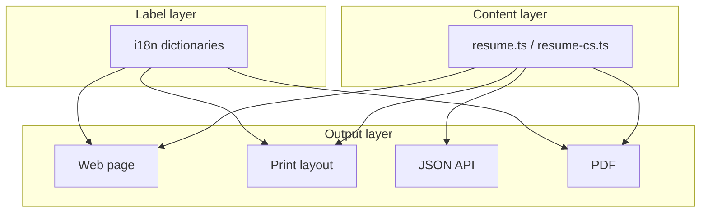

# Project guide

This document explains how the CV site is built, where content lives, and how to change or extend it.

## Overview

The site is a bilingual (English / Czech) resume and portfolio built with **Next.js 16**, **React 19**, and **Tailwind CSS 4**. All resume content is stored as typed TypeScript data - there is no CMS or database. The same data powers the web page, browser print layout, JSON API, and PDF export.

**Two kinds of text exist in the project:**

| Kind | Where it lives | Example |
|------|----------------|---------|
| Resume content | `src/data/resume.ts`, `src/data/resume-cs.ts` | Job titles, bullet points, project descriptions |
| UI labels | `src/i18n/dictionaries/en.ts`, `src/i18n/dictionaries/cs.ts` | "Download PDF", "Present", section headings |

Resume content is fully translated per locale. UI labels are shared infrastructure so buttons, nav items, and aria text stay consistent.

## Tech stack

- **Next.js 16** - App Router, server components, API routes
- **TypeScript** - types in `src/types/`, runtime validation with **Zod**
- **Tailwind CSS 4** - styling via `src/app/globals.css`
- **next-themes** - light / dark / system theme
- **@react-pdf/renderer** - server-side PDF generation
- **pnpm** - package manager (`packageManager` field in `package.json`)

## Project structure

```
src/
├── app/                    # Next.js routes and layouts
│   ├── layout.tsx          # Root HTML shell, fonts, theme provider
│   ├── [locale]/           # Locale-prefixed pages (/en, /cs)
│   │   ├── layout.tsx      # Locale validation, JSON-LD, LocaleProvider
│   │   └── page.tsx        # Main resume page (all sections)
│   └── api/
│       ├── resume/route.ts # JSON resume + computed fields
│       └── pdf/route.ts    # PDF download
├── components/             # UI sections and shared widgets
├── data/                   # Resume content (the main thing you edit)
│   ├── resume.ts           # English resume
│   ├── resume-cs.ts        # Czech resume
│   └── index.ts            # getResumeData(locale) lookup
├── i18n/                   # Locale config and UI dictionaries
├── lib/                    # Helpers, SEO, PDF, schema validation
├── styles/print.css        # Print-only layout
├── types/resume.ts         # TypeScript interfaces for resume shape
└── proxy.ts                # Locale routing (redirects / → /en or /cs)
public/                     # Static assets (favicon, fonts, project images)
```

## Request flow

When someone visits the site, this is what happens:

```mermaid
flowchart TD
    A[Browser request] --> B[src/proxy.ts]
    B -->|no locale in URL| C[Redirect to /en or /cs]
    B -->|URL has /en or /cs| D[Set x-next-locale header + locale cookie]
    D --> E[src/app/[locale]/page.tsx]
    E --> F[getRequestLocale]
    F --> G[Render sections with getResume + getDictionary]
    G --> H[HTML response]
```

`src/proxy.ts` handles locale detection:

- If the URL already contains `/en` or `/cs`, the request continues and a `locale` cookie is set.
- Otherwise, the visitor is redirected based on the `locale` cookie, `Accept-Language` header (Czech preferred), or the default (`en`).

`getRequestLocale()` in `src/i18n/get-request-locale.ts` reads the `x-next-locale` header set by the proxy and returns the active locale to server components.

## Data layer

### Resume files

The primary files you edit for content changes:

- `src/data/resume.ts` - English
- `src/data/resume-cs.ts` - Czech

Each file exports a `Resume` object validated at build time by Zod:

```ts
export const resume: Resume = resumeSchema.parse({ ... });
```

If you add a field with the wrong type, miss a required field, or use an invalid enum value, the build fails immediately. This catches typos before they reach production.

### Schema and types

| File | Purpose |
|------|---------|
| `src/types/resume.ts` | TypeScript interfaces (`Resume`, `ExperienceItem`, etc.) |
| `src/lib/resume-schema.ts` | Zod schema - must stay in sync with types |
| `src/data/index.ts` | Maps locale → resume data via `getResumeData(locale)` |

When adding a new field to the resume, update **all three**: the type, the Zod schema, and both resume data files.

### Computed values

`src/lib/resume.ts` derives display values from raw data:

- `getFullName()` - first + last name
- `calculateYearsOfExperience()` - span across experience entries
- `getCurrentPosition()` - jobs without `endDate`
- `calculateAge()` - from `profile.birthDate`
- `getLastUpdatedFormatted()` - formatted `metadata.lastUpdated`

These are used in the hero, footer, API response, and PDF. You usually do not edit this file unless the calculation logic itself needs to change.

### Allowed enum values

Some fields only accept specific strings. Using anything else will fail Zod validation:

- `employmentType`: `"Full-time"`, `"Part-time"`, `"Contract"`, `"Freelance"`, `"Internship"`
- `availability`: `"Open to opportunities"`, `"Actively looking"`, `"Not looking"`, `"Freelance available"`
- `language.level`: `"Native"`, `"Fluent"`, `"Professional"`, `"Intermediate"`, `"Basic"`
- `skills[].category`: `"Frontend"`, `"Backend"`, `"Databases"`, `"Cloud"`, `"DevOps"`, `"Platforms"`, `"Testing"`, `"Languages"`, `"Tools"`
- `socialLinks[].platform`: `"GitHub"`, `"LinkedIn"`, `"Twitter"`, `"Portfolio"`, `"Other"`

The **keys** for `employmentType`, `availability`, and `languageLevel` stay in English in the data files. Their display text comes from the dictionaries (`dictionary.employmentType[item.employmentType]`, etc.).

## Internationalization

### Locale config

`src/i18n/config.ts` defines:

- `locales` - `["en", "cs"]`
- `defaultLocale` - `"en"`
- `dateLocales` - used by `formatDateRange()` for localized month names
- `localeLabels` - shown in the language switcher

### UI dictionaries

`src/i18n/dictionaries/en.ts` and `cs.ts` hold labels for navigation, buttons, section titles, print layout, SEO site name, and enum display text. The `Dictionary` interface in `src/i18n/types.ts` defines the required shape.

When you add a new UI string, add it to **both** dictionary files and update `src/i18n/types.ts`.

### LocaleProvider

`src/components/locale-provider.tsx` wraps the page and exposes `{ locale, dictionary, resume }` to client components via `useLocale()`. Client components like `Navbar`, `DownloadPdfButton`, and `ThemeToggle` use this hook instead of receiving props.

Server components (most section components) receive `locale` as a prop and call `getResume(locale)` and `getDictionary(locale)` directly.

## Page and components

### Main page

`src/app/[locale]/page.tsx` assembles the full page:

- `PrintResume` - hidden on screen, visible when printing (`Ctrl+P`)
- Screen layout - `Navbar` + section components + `Footer`
- Sections: Hero, Summary, Experience, Projects, Skills, Education, Certifications, Languages, Contact

### Section component pattern

Most sections follow the same pattern (see `src/components/experience.tsx`):

```tsx
export function Experience({ locale }: { locale: Locale }) {
  const resume = getResume(locale);
  const dictionary = getDictionary(locale);
  // render resume data + dictionary labels
}
```

### Navbar

`src/components/navbar.tsx` is a client component. It reads nav labels from `useLocale()`, tracks scroll position for the active section, and conditionally hides the Certifications link when `resume.certifications` is empty.

### Shared UI

`src/components/ui/` contains reusable primitives (`Button`, `Badge`, `Card`) built with Radix Slot and `class-variance-authority`. `src/components/section.tsx` wraps each resume section with a consistent heading and anchor `id`.

## Print and PDF

The site has **two** export paths:

### Browser print

`src/components/print-resume.tsx` renders a condensed print layout. It is `hidden` on screen and shown via `print:block` and `src/styles/print.css`. The screen layout is wrapped in `print:hidden` on the main page.

Print-specific text transformations live in `src/lib/resume-print.ts` (condensed skills, contact line, selected projects, etc.).

### PDF download

`src/components/download-pdf-button.tsx` opens `/api/pdf?lang={locale}`.

The API route (`src/app/api/pdf/route.ts`) calls `generateResumePdf()` in `src/lib/pdf/generate.tsx`, which renders `src/lib/pdf/resume-document.tsx` with `@react-pdf/renderer`. Fonts are registered in `src/lib/pdf/fonts.ts` from `public/fonts/`.

PDF content comes from the same resume data as the website. After editing resume content, both the page and PDF update automatically.

## API

### `GET /api/resume?lang=en`

Returns the full resume JSON plus a `computed` object:

```json
{
  "profile": { ... },
  "experience": [ ... ],
  "computed": {
    "fullName": "...",
    "yearsOfExperience": 3,
    "age": 22,
    "currentPosition": "...",
    "currentYear": 2026
  }
}
```

Useful for external tools, scripts, or future integrations.

### `GET /api/pdf?lang=en`

Returns a PDF file with `Content-Disposition: attachment`. Cached with `no-store`.

## SEO and metadata

| File | Role |
|------|------|
| `src/lib/seo.ts` | Page title, description, Open Graph, canonical URLs |
| `src/lib/json-ld.ts` | Structured `Person` schema injected in locale layout |
| `src/app/sitemap.ts` | Sitemap entries for `/en` and `/cs` |
| `src/app/robots.ts` | Robots.txt rules |

SEO pulls from `resume.metadata.canonicalUrl`, `resume.metadata.keywords`, and `resume.metadata.lastUpdated`. Update `canonicalUrl` in both resume files when deploying to production.

## Styling and theme

- Global styles and CSS variables: `src/app/globals.css`
- Print styles: `src/styles/print.css`
- Theme toggle: `src/components/theme-toggle.tsx` via `next-themes`
- Utility merge helper: `cn()` in `src/lib/utils.ts`
- Date formatting: `formatDateRange()`, `formatYearsExperience()` in `src/lib/utils.ts`

Dark mode uses the `class` strategy on `<html>`. Tailwind utility classes reference CSS variables defined in `globals.css`.

## Common edits

### Update your job, project, or skill

Edit the relevant array in `src/data/resume.ts` and mirror the change in `src/data/resume-cs.ts`. Each item needs a unique `id` string. Use ISO date strings for dates (`"2025-09-01"`). Omit `endDate` for current positions.

### Change name, title, contact, or availability

Edit `profile` and `contact` in both resume files. Update `socialLinks` for GitHub, LinkedIn, etc.

### Change availability badge text

The value in data stays English (`"Open to opportunities"`). Change the displayed label in `src/i18n/dictionaries/en.ts` and `cs.ts` under `availability`.

### Add a project image

Place the file in `public/projects/` and set `image: "/projects/your-file.svg"` on the project item.

### Update last modified date

Set `metadata.lastUpdated` in both resume files. This affects the footer, sitemap, and SEO.

### Change site URL for production

Set `metadata.canonicalUrl` in both resume files to your live domain (e.g. `https://yourname.dev`).

## Adding a new section

To add a section (e.g. Publications):

**Data** - Add a `publications` array to the `Resume` type in `src/types/resume.ts`, the Zod schema in `src/lib/resume-schema.ts`, and both resume data files.

**Dictionary** - Add `sections.publications` and any labels to `src/i18n/types.ts` and both dictionary files.

**Component** - Create `src/components/publications.tsx` following the `Experience` pattern.

**Page** - Import and render it in `src/app/[locale]/page.tsx`.

**Navigation** - Add a nav item in `src/components/navbar.tsx` with a matching `id` on the section.

**Print / PDF** - Optionally extend `src/components/print-resume.tsx` and `src/lib/pdf/resume-document.tsx`.

## Adding a new locale

**Config** - Add the locale code to `locales` in `src/i18n/config.ts` and fill in `localeLabels`, `dateLocales`, and `openGraphLocales`.

**Resume data** - Create `src/data/resume-{locale}.ts` and register it in `src/data/index.ts`.

**Dictionary** - Create `src/i18n/dictionaries/{locale}.ts` and register it in `src/i18n/get-dictionary.ts`.

**SEO** - Add the locale to `alternates.languages` in `src/lib/seo.ts` and to `src/app/sitemap.ts`.

The proxy, language switcher, and PDF route pick up new locales automatically from the `locales` array.

## Development

```bash
pnpm install    # install dependencies
pnpm dev        # start dev server (http://localhost:3000)
pnpm build      # production build (runs Zod validation)
pnpm start      # serve production build
pnpm lint       # run ESLint
```

During development, visit `/en` or `/cs` directly. The proxy redirects `/` to the appropriate locale.

## Mental model

Think of the project in three layers:



**Content changes** → edit `src/data/`. **Button or heading text** → edit `src/i18n/dictionaries/`. **Layout or behavior** → edit `src/components/` or `src/app/`. **Validation errors on build** → check `src/lib/resume-schema.ts` and enum values in your data.

That is the full loop: edit data, dictionaries, or components → `pnpm dev` to preview → `pnpm build` to verify → deploy.
